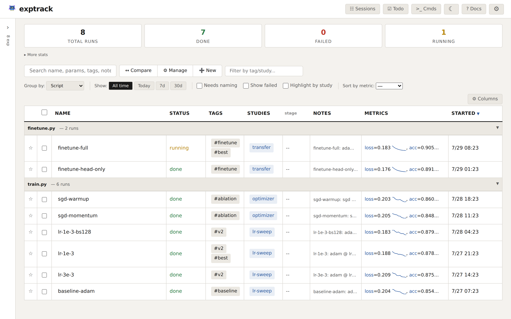
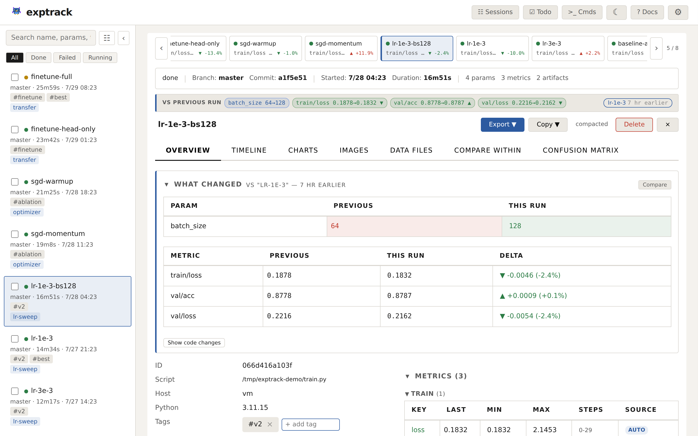
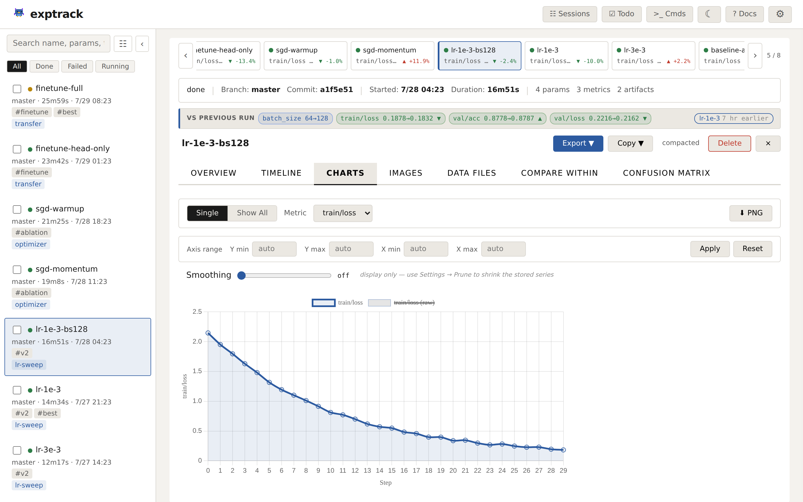

# exptrack

[](https://www.python.org/downloads/)
[](https://opensource.org/licenses/MIT)
[](#what-it-does)
[](https://www.sqlite.org/)

**A local experiment tracker for ML workflows.** Captures parameters, metrics, git state, and code changes from your training scripts and notebooks automatically. Uses only the Python standard library and stores everything in a single SQLite file.

```bash
pip install exptrack && cd my_project && exptrack init

# Prefix your training command. Parameters, git state, and artifacts
# are captured without any changes to your script.
exptrack run train.py --lr 0.01 --epochs 20 --data cifar10

exptrack ls        # list experiments
exptrack ui        # open the web dashboard
```

---

## Dashboard



Filter, compare, tag, and explore experiments from a local web UI. Runs on localhost with no accounts or internet needed. Runs group by script by default, so a burst of near-identical attempts reads as one block instead of a flat list.

Every run's detail view opens with **what changed** since the last run of the same script — the params you edited, the metric deltas they produced, and the code diff behind them — plus a filmstrip for stepping between runs without going back to the list.



The **Charts** tab plots every logged metric with linear/log scales, typed axis bounds, and a display-only smoothing slider (the raw series stays visible behind it). Charts on a live run update in place every 5 seconds without resetting your tab, zoom, or metric pick.



---

## What It Does

**Organize experiments with studies, tags, and stages.** Group related runs into studies (e.g., a train → eval → analyze pipeline), label them with tags (`baseline`, `v2`, `ablation`), and define numbered stages within each study.

**Track Jupyter notebooks in detail.** Every cell execution is recorded: code diffs between runs, variable changes with fingerprinting, and hyperparameter-like variables (`lr`, `batch_size`) are captured as parameters automatically.

**Compare experiments visually.** Side-by-side parameter diffs with overlay metric charts for pairs. Bar charts across three or more runs. Image artifacts support swipe and overlay comparison.

**See what changed between one run and the next.** Every run opens with a diff against the previous run of the same script — the params you edited, the metric deltas, and the code behind them. Deltas are polarity-aware: a rising `loss` is coloured as a regression, not an improvement.

**Chart metrics over time.** Interactive charts with linear/log scale, typed axis bounds, configurable downsampling, and a display-only smoothing slider. Write-time thinning for long training runs, plus `exptrack prune` to thin series you already recorded (first, last, min and max always survive). Sparkline previews in the experiment list.

**Capture git state automatically.** Branch, commit hash, and full diff against HEAD are stored with every run, plus a content-addressed snapshot of the script's own source — so two runs stay diffable against each other after you've edited the file.

**Mirror TensorBoard scalars automatically.** If your code already calls `SummaryWriter.add_scalar` / `add_scalars` / `add_histogram`, those values land in exptrack's metrics table too. No new dependency, no code change.

**Version your inputs.** When a run finishes, dataset-shaped parameters (`--data_dir`, `--train`, a `.csv`/`.parquet` path) are fingerprinted — size and content hash for files, a listing fingerprint for directories — and shown as a Datasets section on the run.

**Keep failures useful.** A crashed run records the full traceback, not just the message, and the dashboard shows it in a **Run failed** panel. A failed run stays available as a comparison baseline, because "it broke, I fixed it, what changed?" is the point.

**Log and compare image artifacts.** `plt.savefig()` calls are captured automatically. View images in a gallery grid, lightbox, or side-by-side/overlay comparison between experiments.

**Delete safely.** Deleting a run moves it to a Trash you can restore from; permanent deletion is a separate, explicit step, and files go to the OS Trash rather than being unlinked.

**Explore in a notebook without losing the thread.** Session Trees record the *shape* of exploration — checkpoints, branches, scratch and setup cells — as a tree you can compare, promote into experiments, and finalize into a study. See [Session Trees](docs/session-trees.md).

**Run entirely on your machine.** One SQLite file, standard library only, no accounts or internet. Data stays local.

---

## Four Ways to Use It

### 1. Wrap a script (easiest)

```bash
exptrack run train.py --lr 0.01 --epochs 20
```

Your script needs no modifications. exptrack captures argparse parameters, git state, code changes, and `plt.savefig()` artifacts automatically.

To log metrics, use the injected `__exptrack__` global:

```python
# Available only under `exptrack run`, no imports needed
exp = globals().get("__exptrack__")
for epoch in range(epochs):
    loss, acc = train(...)
    if exp:
        exp.log_metrics({"loss": loss, "accuracy": acc}, step=epoch)
```

The script still works with plain `python train.py`. The metrics lines are skipped when `exp` is `None`.

### 2. Jupyter notebook

```python
%load_ext exptrack   # add this to your first cell
```

Every cell is tracked: code diffs, variable changes, hyperparameter-like variables (`lr`, `batch_size`, etc.) become parameters, and `plt.savefig()` calls register artifacts.

**Or use the explicit API:**

```python
import exptrack.notebook as exp

exp.start(lr=0.001, bs=32)
exp.metric("val/loss", 0.23, step=5)
exp.done()
```

### 2b. Session Trees (notebook, opt-in)

Standard `%load_ext exptrack` records *what* you ran. **Session Trees** record
*how you got there* — the shape of your exploration as a tree of checkpoints
and branches you can read back weeks later. Activate explicitly (no session →
all session magics are silent no-ops, normal tracking is unchanged):

```python
%load_ext exptrack
%exptrack session start "exploring threshold sensitivity"

# ...preprocess, run cells normally...

%exptrack checkpoint "after preprocessing clean"   # AFTER a stable change
%exptrack branch "try threshold 0.7 instead of 0.5" # BEFORE diverging

# ...try the new threshold...

%%scratch
# anything in this cell is executed but NEVER logged

%exptrack checkpoint "threshold 0.7 works"          # AFTER it works
%exptrack promote "0.7 outperformed baseline"       # link active exp to node
%exptrack session end
```

**Timing rules of thumb:**

| Magic | Run it… | Why |
|---|---|---|
| `%exptrack session start "..."` | once, **before** any other session magic | nothing else activates without it |
| `%exptrack checkpoint "..."` | **after** a stable change you might want to return to | snapshots a per-checkpoint git diff vs. the previous checkpoint |
| `%exptrack branch "..."` | **before** you start diverging | declares intent for the next segment of work; attaches under the most recent checkpoint |
| `%%scratch` | as the **first line** of any throwaway cell | the cell runs but the post-cell hook skips all logging |
| `%exptrack promote "..."` | **after** a run finishes promisingly | links the active `Experiment` to the current node so it shows up as `→ exp <id>` in the tree |
| `%exptrack session end` | when you're done exploring | open branches with no checkpoint flip to *abandoned* (still visible, dimmed) |

Inspect from the CLI or the dashboard's `☰ Sessions` tab:

```bash
exptrack sessions                # list sessions
exptrack session show <id>       # ASCII tree
exptrack session note <node> "…" # annotate a node after the fact
```

Full guide: [`docs/session-trees.md`](docs/session-trees.md).

### 3. Shell / SLURM pipeline

For shell scripts, SLURM jobs, or multi-step workflows.

**Your script (`run.sh`):**

```bash
#!/bin/bash
LR=$1
EPOCHS=$2

eval $(exptrack run-start --name "$3" --lr $LR --epochs $EPOCHS)

python train.py --lr $LR --epochs $EPOCHS --output "$EXP_OUT"

exptrack run-finish $EXP_ID --metrics "$EXP_OUT/results.json"
```

**In your terminal:**

```bash
bash run.sh 0.01 50  baseline
bash run.sh 0.1  100 higher-lr

exptrack ls                       # see both runs
```

`eval $(exptrack run-start ...)` creates a new experiment and sets three variables inside your script: `$EXP_ID` (experiment ID), `$EXP_NAME` (run name), and `$EXP_OUT` (output directory — files written here are auto-discovered as artifacts). Each run of the script creates a separate experiment. On failure, call `exptrack run-fail $EXP_ID "reason"`.

**SLURM** — submit with `sbatch run.sh`. SLURM env vars are captured automatically:

```bash
#!/bin/bash
#SBATCH --job-name=train_resnet
#SBATCH --gpus=1

eval $(exptrack run-start --lr 0.001 --batch-size 256)
trap 'exptrack run-fail "$EXP_ID" "Exit code $?"' ERR

python train.py --lr 0.001 --output "$EXP_OUT"
exptrack run-finish "$EXP_ID" --metrics "$EXP_OUT/results.json"
```

**Multi-step** — set `--study` on the first step, subsequent steps inherit it:

```bash
#!/bin/bash
eval $(exptrack run-start --study my-ablation --stage 1 --stage-name train --lr 0.01)
python train.py; exptrack run-finish $EXP_ID

# EXP_STUDY inherited, EXP_STAGE auto-increments to 2
eval $(exptrack run-start --stage-name eval)
python eval.py; exptrack run-finish $EXP_ID
```

### Resuming experiments

If your script has a `--resume` flag, exptrack auto-detects it and continues the **same experiment** instead of creating a new one. Metrics, artifacts, and params all aggregate into the original run.

```bash
# First run
exptrack run train.py --lr 0.01 --epochs 50 --output_dir results/

# Resume from checkpoint — same experiment, metrics continue from where you left off
exptrack run train.py --lr 0.01 --epochs 100 --output_dir results/ --resume --ckpt results/model.pt
```

No extra flags for exptrack. Your script's `--resume` does double duty. See [Configuration](docs/configuration.md) if your script uses a different flag like `--continue` or `--load-checkpoint`.

### 4. Python API (full control)

```python
from exptrack.core import Experiment

with Experiment(params={"lr": 0.01, "optimizer": "adam"}) as exp:
    for epoch in range(100):
        loss, acc = train(...)
        exp.log_metrics({"loss": loss, "accuracy": acc}, step=epoch)
    exp.add_tag("baseline")
```

---

## What Gets Captured Automatically

| | Scripts | Notebooks | Shell/SLURM | Python API |
|---|---|---|---|---|
| **Params** | From argparse / sys.argv | From HP-like variables | You pass them | You log them |
| **Git state** | Yes | Yes | Yes | Yes |
| **Code changes** | Script diff vs last commit | Cell diffs + variable changes | | |
| **Artifacts** | `plt.savefig` + new files | `plt.savefig` | You log them | You log them |
| **Status** | Automatic (done/failed) | You call `done()` | You call `run-finish` | Automatic with `with` |

Metrics always need explicit logging. exptrack captures what you ran and how your code changed, but it can't decide which numbers matter to you.

---

## Managing Experiments

```bash
# List and inspect
exptrack ls                        # last 20 experiments
exptrack show <id>                 # full details
exptrack diff <id>                 # colorized git diff
exptrack compare <id1> <id2>       # side-by-side comparison
exptrack history <id>              # param/metric change history
exptrack timeline <id>             # chronological event log

# Tag, annotate, and organize
exptrack tag <id> baseline
exptrack note <id> "tried higher dropout, worse results"
exptrack study <id> ablation-v2    # group into a study
exptrack stage <id> 1 train        # assign a numbered stage

# Export (JSON, Markdown, CSV, TSV)
exptrack export <id>               # JSON summary to stdout
exptrack export <id> --full        # every metric point + every artifact
exptrack export <id> --format csv  # CSV
exptrack export --all --format md  # bulk export

# Clean up and maintenance
exptrack rm <id>                   # delete one run
exptrack clean                     # bulk-delete all failed runs
exptrack compact                   # strip git diffs to save space
exptrack backup                    # backup the database
exptrack restore <path>            # restore from backup
exptrack storage                   # show DB size and stats
```

**Exports are summaries by default.** A run that logs every iteration stores tens of thousands of metric points and can register thousands of checkpoints — dumping one JSON object per point and one per file buried the params and the final numbers under the raw data. So every format, JSON included, ships one entry per metric key (`count`, `first`, `last`, `min`, `max`, with the step each extreme occurred at) and a capped artifact list alongside an `artifacts_summary` giving the shape of the rest — counts by type and by containing directory (`outputs/ckpts: 3990`). Nothing is dropped silently: the summary always states how many were omitted.

Add `--full` (or `?full=1` on the dashboard's export endpoint, **Export → JSON (full)** in the UI) for the complete, round-trippable payload: the raw `metrics_series` and every artifact. `--max-artifacts N` sets the list cap directly; `0` lists them all.

---

## Dashboard Features

```bash
exptrack ui                  # auto-generates a per-session token, prints URL
exptrack ui --token secret   # set a persistent token (saved to .exptrack/dashboard_token)
exptrack ui --no-auth        # disable auth (local-only, trusted environments)
exptrack ui-stop             # kill a stale dashboard still holding port 7331
```

- **Experiment list** grouped by script (or study, branch, commit, day), with status filters, search, sparkline charts, and customizable columns — including any captured parameter as a sortable column, one click to add the ones that actually vary between runs
- **Detail view** with a "what changed vs the previous run" strip, parameters, metrics, interactive charts, code changes, git diff, datasets, a **Run failed** traceback panel, and a reproducible command with one-click copy
- **Filmstrip** across the top of the detail view — step between runs with ← / → without going back to the list
- **Compare** experiments pair-wise (side-by-side with overlay charts, plus a code-diff panel) or across 3+ runs (bar charts)
- **Charts tab** with single/all views, linear/log scales, typed axis bounds, downsampling, and a smoothing slider; live runs update in place every 5 seconds without resetting your view
- **Timeline** showing cell executions, variable changes, captured cell output, and artifact creation (notebooks)
- **Sessions** tab rendering Session Trees as a git-style graph — branch, compare, promote a node into an experiment, or finalize a whole session into a study
- **Images** displayed in a gallery grid with lightbox and side-by-side/overlay/swipe comparison
- **Data files** (CSV, JSON, JSONL, TSV) rendered as interactive sortable tables
- **Confusion matrix** calculator per run — multiple named matrices, side-by-side compare, results saveable as metrics
- **Trash** with restore, plus an explicit permanent-delete step (files go to the OS Trash)
- **Storage panel** showing bytes by metric key and the largest runs, with a **Prune…** action that previews before it deletes
- **Toolbox** with a commands notepad (templated `{{variables}}`, exportable as a runnable `.sh`) and a todo list with due dates; pinnable as a side panel
- **Manual experiment creation** for logging runs that weren't tracked automatically
- **Inline editing** for names, tags, notes, studies, and stages (double-click to edit)
- **Studies and stages** to organize multi-step pipelines, with highlight mode and filtering
- Tag autocomplete, searchable filter dropdowns, "needs naming" filter, timezone selector, dark mode, bulk operations, and export (JSON summary, JSON full, Markdown, CSV, TSV, Text)

---

## Installation

```bash
# From GitHub
pip install git+https://github.com/mikylab/exptrack.git

# Local / development
git clone https://github.com/mikylab/exptrack.git
cd exptrack && pip install -e .
```

Only standard library dependencies. Requires Python 3.8+.

**Does it affect other packages?** Patches only activate when you explicitly use `exptrack run` or `%load_ext exptrack`, and they're removed when the script or session ends.

---

## Examples

The [`examples/`](examples/) directory has ready-to-run scripts:

| Example | What it shows |
|---------|---------------|
| [`basic_script.py`](examples/basic_script.py) | Automatic tracking with `exptrack run`, no imports needed |
| [`resnet_exptrack_run.py`](examples/resnet_exptrack_run.py) | Metric logging via the `__exptrack__` global |
| [`resnet_python_api.py`](examples/resnet_python_api.py) | Same training using the explicit Python API |
| [`manual_tracking.py`](examples/manual_tracking.py) | Full lifecycle: parameters, metrics, tags, artifacts |
| [`notebook_example.py`](examples/notebook_example.py) | Notebook API as a plain script |
| [`shell_script_example.sh`](examples/shell_script_example.sh) | Pure shell workflow (no Python in the workload) |
| [`pipeline_example.sh`](examples/pipeline_example.sh) | Shell/SLURM single-step pipeline |
| [`pipeline_multistep.sh`](examples/pipeline_multistep.sh) | Multi-step pipeline: train, test, analyze |
| [`pipeline_wrapper.sh`](examples/pipeline_wrapper.sh) | Wrapper script with auto-inherited study and stages |
| [`slurm_job.sh`](examples/slurm_job.sh) | SLURM sbatch script with error trapping |
| [`resume_training.py`](examples/resume_training.py) | Resuming a run — metrics aggregate into one experiment |

---

## Further Documentation

| Doc | What's in it |
|-----|-------------|
| [CLI Reference](docs/cli-reference.md) | All 24 subcommands |
| [Configuration](docs/configuration.md) | Every `.exptrack/config.json` option |
| [Python API](docs/python-api.md) | `Experiment` class properties and methods |
| [Plugins](docs/plugins.md) | Writing plugins, GitHub Sync |
| [How It Works](docs/how-it-works.md) | Capture mechanisms, storage design, schema |
| [FAQ](docs/faq.md) | Common questions |
| [Troubleshooting](docs/troubleshooting.md) | Solutions for common issues |
| [Contributing](docs/contributing.md) | Development setup, linting, guidelines |

---

## License

MIT. See [LICENSE](https://opensource.org/licenses/MIT).
