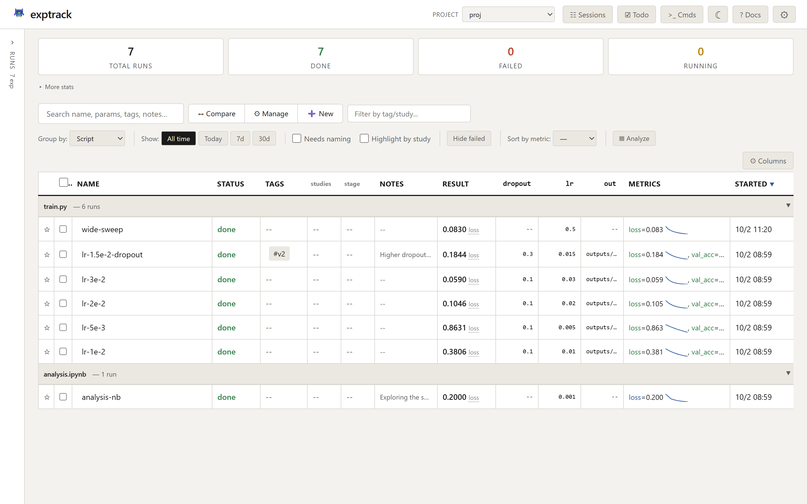
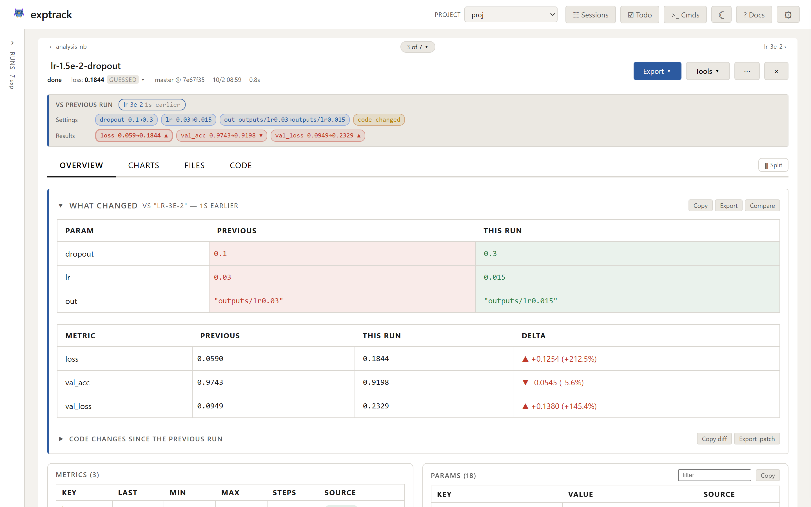
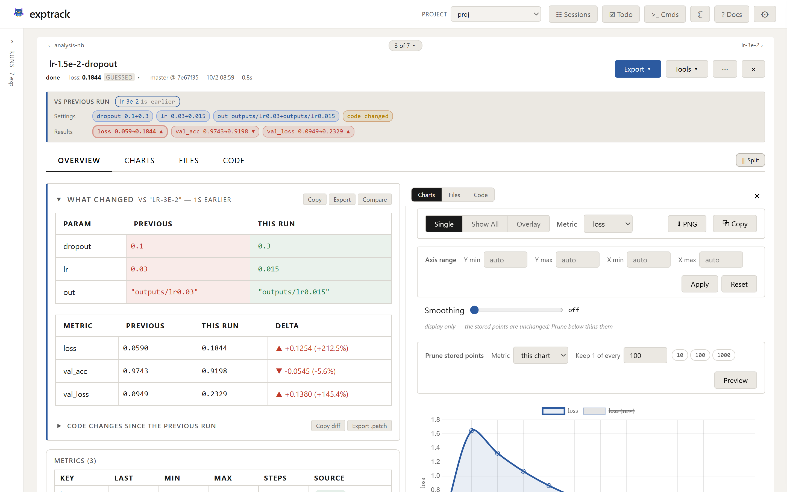
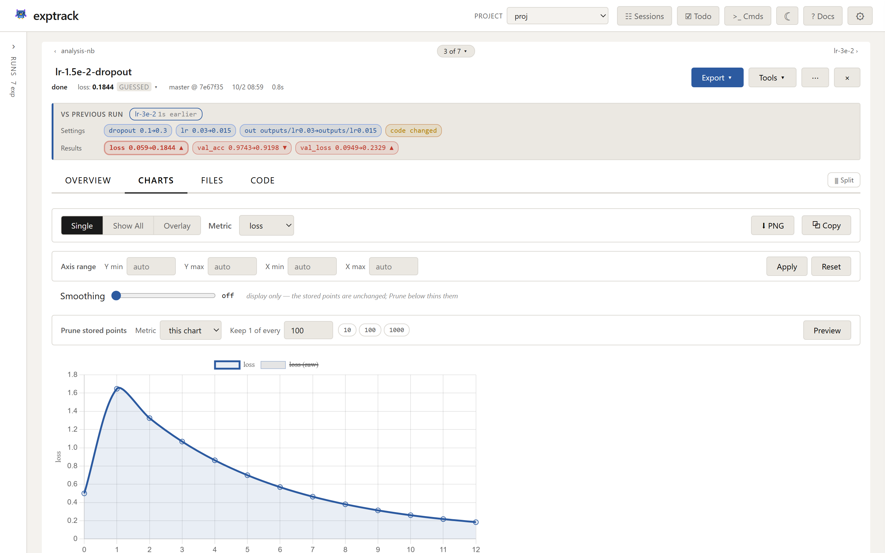

# exptrack

[](https://www.python.org/downloads/)
[](https://opensource.org/licenses/MIT)
[](#what-it-does)
[](https://www.sqlite.org/)

**A local experiment tracker for ML workflows.** Captures parameters, metrics, git state, and code changes from your training scripts and notebooks automatically. Uses only the Python standard library and stores everything in a single SQLite file.

```bash
pip install exptrack && cd my_project && exptrack init

# Prefix your training command. Parameters, git state, and artifacts
# are captured without any changes to your script.
exptrack run train.py --lr 0.01 --epochs 20 --data cifar10

exptrack ls        # list experiments
exptrack ui        # open the web dashboard
```

---

## Dashboard



Filter, compare, tag, and explore experiments from a local web UI. Runs on localhost with no accounts or internet needed. Runs group by script by default, so a burst of near-identical attempts reads as one block instead of a flat list.

Start it in the background with `exptrack ui start` (it prints a URL with an auth token already in it), or in the foreground with plain `exptrack ui`. One dashboard serves every project this machine knows about — the switcher beside the page title moves between them without a second server on a second port. See [Dashboard Features](#dashboard-features) for the access and multi-project details.

Every run's detail view opens with **what changed** since the last run of the same script — the params you edited, the metric deltas they produced, and the code diff behind them. Four tabs hold the rest — **Overview**, **Charts**, **Files** and **Code** (where a notebook run's cell timeline lives) — and **⫼ Split** puts two of them side by side. ‹ › steps between runs without going back to the list.



**⫼ Split** puts a second tab beside the first, so what changed and the curves it produced read side by side.



The **Charts** tab plots every logged metric with linear/log scales, typed axis bounds, and a display-only smoothing slider (the raw series stays visible behind it). Charts on a live run update in place every 5 seconds without resetting your tab, zoom, or metric pick.



---

## What It Does

**Organize experiments with studies, tags, and stages.** Group related runs into studies (e.g., a train → eval → analyze pipeline), label them with tags (`baseline`, `v2`, `ablation`), and define numbered stages within each study.

**Track Jupyter notebooks in detail.** Every cell execution is recorded: code diffs between runs, variable changes with fingerprinting, and hyperparameter-like variables (`lr`, `batch_size`) are captured as parameters automatically.

**Compare experiments visually.** Side-by-side parameter diffs with overlay metric charts for pairs. Bar charts across three or more runs. Image artifacts support swipe and overlay comparison.

**See what changed between one run and the next.** Every run opens with a diff against the previous run of the same script — the params you edited, the metric deltas, and the code behind them. Deltas are polarity-aware: a rising `loss` is coloured as a regression, not an improvement.

**Chart metrics over time.** Interactive charts with linear/log scale, typed axis bounds, configurable downsampling, and a display-only smoothing slider. Write-time thinning for long training runs, plus `exptrack prune` to thin series you already recorded (first, last, min and max always survive). Sparkline previews in the experiment list.

**Capture git state automatically.** Branch, commit hash, and full diff against HEAD are stored with every run, plus a content-addressed snapshot of the script's own source — so two runs stay diffable against each other after you've edited the file.

**Mirror TensorBoard scalars automatically.** If your code already calls `SummaryWriter.add_scalar` / `add_scalars` / `add_histogram`, those values land in exptrack's metrics table too. No new dependency, no code change.

**Version your inputs.** When a run finishes, dataset-shaped parameters (`--data_dir`, `--train`, a `.csv`/`.parquet` path) are fingerprinted — size and content hash for files, a listing fingerprint for directories — and shown as a Datasets section on the run.

**Keep failures useful.** A crashed run records the full traceback, not just the message, and the dashboard shows it in a **Run failed** panel. A failed run stays available as a comparison baseline, because "it broke, I fixed it, what changed?" is the point.

**Log and compare image artifacts.** `plt.savefig()` calls are captured automatically. View images in a gallery grid, lightbox, or side-by-side/overlay comparison between experiments.

**Delete safely.** Deleting a run moves it to a Trash you can restore from; permanent deletion is a separate, explicit step, and files go to the OS Trash rather than being unlinked.

**Explore in a notebook without losing the thread.** Session Trees record the *shape* of exploration — checkpoints, branches, scratch and setup cells — as a tree you can compare, promote into experiments, and finalize into a study. See [Session Trees](https://github.com/mikylab/exptrack/blob/main/docs/session-trees.md).

**Run entirely on your machine.** One SQLite file, standard library only, no accounts or internet. Data stays local.

---

## Four Ways to Use It

### 1. Wrap a script (easiest)

```bash
exptrack run train.py --lr 0.01 --epochs 20
```

Your script needs no modifications. exptrack captures argparse parameters, git state, code changes, and `plt.savefig()` artifacts automatically.

To log metrics, use the injected `__exptrack__` global:

```python
# Available only under `exptrack run`, no imports needed
exp = globals().get("__exptrack__")
for epoch in range(epochs):
    loss, acc = train(...)
    if exp:
        exp.log_metrics({"loss": loss, "accuracy": acc}, step=epoch)
```

The script still works with plain `python train.py`. The metrics lines are skipped when `exp` is `None`.

### 2. Jupyter notebook

```python
%load_ext exptrack   # add this to your first cell
```

Every cell is tracked: code diffs, variable changes, hyperparameter-like variables (`lr`, `batch_size`, etc.) become parameters, and `plt.savefig()` calls register artifacts.

**Or use the explicit API:**

```python
import exptrack.notebook as exp

exp.start(lr=0.001, bs=32)
exp.metric("val/loss", 0.23, step=5)
exp.done()
```

**Got the test numbers after the run finished?** Attach them without hunting for
the run id — this works after `%exp_done`, and prints which run it logged onto:

```python
%exp_log test_acc=0.93 train_acc=0.98
```

**Re-ran the same notebook with a different model?** Point the new run at the one
you actually want to compare against, and the "vs previous" delta and "What
changed" card both use it instead of whatever happened to run last:

```bash
exptrack variant-of <new_run_id> <original_run_id>
```

### 2b. Session Trees (notebook, opt-in)

Standard `%load_ext exptrack` records *what* you ran. **Session Trees** record
*how you got there* — the shape of your exploration as a tree of checkpoints
and branches you can read back weeks later. Activate explicitly (no session →
all session magics are silent no-ops, normal tracking is unchanged):

```python
%load_ext exptrack
%exptrack session start "exploring threshold sensitivity"

# ...preprocess, run cells normally...

%exptrack checkpoint "after preprocessing clean"   # AFTER a stable change
%exptrack branch "try threshold 0.7 instead of 0.5" # BEFORE diverging

# ...try the new threshold...

%%scratch
# anything in this cell is executed but NEVER logged

%exptrack checkpoint "threshold 0.7 works"          # AFTER it works
%exptrack promote "0.7 outperformed baseline"       # link active exp to node
%exptrack session end
```

**Timing rules of thumb:**

| Magic | Run it… | Why |
|---|---|---|
| `%exptrack session start "..."` | once, **before** any other session magic | nothing else activates without it |
| `%exptrack checkpoint "..."` | **after** a stable change you might want to return to | snapshots a per-checkpoint git diff vs. the previous checkpoint |
| `%exptrack branch "..."` | **before** you start diverging | declares intent for the next segment of work; attaches under the most recent checkpoint |
| `%%scratch` | as the **first line** of any throwaway cell | the cell runs but the post-cell hook skips all logging |
| `%exptrack promote "..."` | **after** a run finishes promisingly | links the active `Experiment` to the current node so it shows up as `→ exp <id>` in the tree |
| `%exptrack session end` | when you're done exploring | open branches with no checkpoint flip to *abandoned* (still visible, dimmed) |

Inspect from the CLI or the dashboard's `☰ Sessions` tab:

```bash
exptrack sessions                # list sessions
exptrack session show <id>       # ASCII tree
exptrack session note <node> "…" # annotate a node after the fact
```

Full guide: [`docs/session-trees.md`](https://github.com/mikylab/exptrack/blob/main/docs/session-trees.md).

### 3. Shell / SLURM pipeline

For shell scripts, SLURM jobs, or multi-step workflows.

**Your script (`run.sh`):**

```bash
#!/bin/bash
LR=$1
EPOCHS=$2

eval $(exptrack run-start --name "$3" --lr $LR --epochs $EPOCHS)

python train.py --lr $LR --epochs $EPOCHS --output "$EXP_OUT"

exptrack run-finish $EXP_ID --metrics "$EXP_OUT/results.json"
```

**In your terminal:**

```bash
bash run.sh 0.01 50  baseline
bash run.sh 0.1  100 higher-lr

exptrack ls                       # see both runs
```

`eval $(exptrack run-start ...)` creates a new experiment and sets three variables inside your script: `$EXP_ID` (experiment ID), `$EXP_NAME` (run name), and `$EXP_OUT` (output directory — files written here are auto-discovered as artifacts). Each run of the script creates a separate experiment. On failure, call `exptrack run-fail $EXP_ID "reason"`.

**SLURM** — submit with `sbatch run.sh`. SLURM env vars are captured automatically:

```bash
#!/bin/bash
#SBATCH --job-name=train_resnet
#SBATCH --gpus=1

eval $(exptrack run-start --lr 0.001 --batch-size 256)
trap 'exptrack run-fail "$EXP_ID" "Exit code $?"' ERR

python train.py --lr 0.001 --output "$EXP_OUT"
exptrack run-finish "$EXP_ID" --metrics "$EXP_OUT/results.json"
```

**Multi-step** — set `--study` on the first step, subsequent steps inherit it:

```bash
#!/bin/bash
eval $(exptrack run-start --study my-ablation --stage 1 --stage-name train --lr 0.01)
python train.py; exptrack run-finish $EXP_ID

# EXP_STUDY inherited, EXP_STAGE auto-increments to 2
eval $(exptrack run-start --stage-name eval)
python eval.py; exptrack run-finish $EXP_ID
```

### Resuming experiments

If your script has a `--resume` flag, exptrack auto-detects it and continues the **same experiment** instead of creating a new one. Metrics, artifacts, and params all aggregate into the original run.

```bash
# First run
exptrack run train.py --lr 0.01 --epochs 50 --output_dir results/

# Resume from checkpoint — same experiment, metrics continue from where you left off
exptrack run train.py --lr 0.01 --epochs 100 --output_dir results/ --resume --ckpt results/model.pt
```

No extra flags for exptrack. Your script's `--resume` does double duty. See [Configuration](https://github.com/mikylab/exptrack/blob/main/docs/configuration.md) if your script uses a different flag like `--continue` or `--load-checkpoint`.

### 4. Python API (full control)

```python
from exptrack.core import Experiment

with Experiment(params={"lr": 0.01, "optimizer": "adam"}) as exp:
    for epoch in range(100):
        loss, acc = train(...)
        exp.log_metrics({"loss": loss, "accuracy": acc}, step=epoch)
    exp.add_tag("baseline")
```

---

## What Gets Captured Automatically

| | Scripts | Notebooks | Shell/SLURM | Python API |
|---|---|---|---|---|
| **Params** | From argparse / sys.argv | From HP-like variables | You pass them | You log them |
| **Git state** | Yes | Yes | Yes | Yes |
| **Code changes** | Script diff vs last commit | Cell diffs + variable changes | | |
| **Artifacts** | `plt.savefig` + new files | `plt.savefig` | You log them | You log them |
| **Status** | Automatic (done/failed) | You call `done()` | You call `run-finish` | Automatic with `with` |

Metrics always need explicit logging. exptrack captures what you ran and how your code changed, but it can't decide which numbers matter to you.

---

## Managing Experiments

```bash
# List and inspect
exptrack ls                        # last 20 experiments
exptrack show <id>                 # full details
exptrack diff <id>                 # colorized git diff
exptrack compare <id1> <id2>       # side-by-side comparison
exptrack history <id>              # param/metric change history
exptrack timeline <id>             # chronological event log

# Tag, annotate, and organize
exptrack tag <id> baseline
exptrack note <id> "tried higher dropout, worse results"
exptrack study <id> ablation-v2    # group into a study
exptrack stage <id> 1 train        # assign a numbered stage

# Export (JSON, Markdown, CSV, TSV)
exptrack export <id>               # JSON summary to stdout
exptrack export <id> --full        # every metric point + every artifact
exptrack export <id> --format csv  # CSV
exptrack export --all --format md  # bulk export

# Clean up and maintenance
exptrack rm <id>                   # delete one run
exptrack clean                     # bulk-delete all failed runs
exptrack compact                   # strip git diffs to save space
exptrack backup                    # backup the database
exptrack restore <path>            # restore from backup
exptrack storage                   # show DB size and stats
```

**Exports are summaries by default.** A run that logs every iteration stores tens of thousands of metric points and can register thousands of checkpoints — dumping one JSON object per point and one per file buried the params and the final numbers under the raw data. So every format, JSON included, ships one entry per metric key (`count`, `first`, `last`, `min`, `max`, with the step each extreme occurred at) and a capped artifact list alongside an `artifacts_summary` giving the shape of the rest — counts by type and by containing directory (`outputs/ckpts: 3990`). Nothing is dropped silently: the summary always states how many were omitted.

Add `--full` (or `?full=1` on the dashboard's export endpoint, **Export → JSON (full)** in the UI) for the complete, round-trippable payload: the raw `metrics_series` and every artifact. `--max-artifacts N` sets the list cap directly; `0` lists them all.

---

## Dashboard Features

```bash
exptrack ui start            # run it in the background; prints the URL with its token
exptrack ui status           # is one running? prints the pid, version, and URL again
exptrack ui logs -n 50 -f    # show (or follow) the background dashboard's log
exptrack ui stop             # stop it, verifying the port was actually released

exptrack ui                  # or run it in the foreground; Ctrl-C to stop
exptrack ui --token secret   # store your own token instead of the generated one
exptrack ui --clear-token    # forget the stored token (the next start mints a new one)
exptrack ui --no-auth        # no token at all — local, trusted machines only
```

`exptrack ui start` detaches the server, so it does not cost you a terminal and it
survives an SSH disconnect. Starting it when one is already running is success, not
an error. `exptrack ui-stop` still works as a deprecated alias for `exptrack ui stop`.

- **Experiment list** grouped by script (or study, branch, commit, day), with status filters, search, sparkline charts, and customizable columns — including any captured parameter as a sortable column, one click to add the ones that actually vary between runs
- **Run page** in four tabs — **Overview** (what changed vs the previous run, metrics, notes, params, reproduce command), **Charts**, **Files** (images, data files, artifacts) and **Code** (timeline, uncommitted diff, captured source, environment) — with **⫼ Split** to read two side by side, a **Run failed** traceback panel, and one Export menu with Copy beside every format
- **Run navigator** — step between runs with ‹ › or ← / →, or jump with **N of M**, without going back to the list
- **Compare** experiments pair-wise (side-by-side with overlay charts, plus a code-diff panel) or across 3+ runs (bar charts)
- **Charts tab** with single/all views, linear/log scales, typed axis bounds, downsampling, and a smoothing slider; live runs update in place every 5 seconds without resetting your view
- **Code › Timeline** showing cell executions, variable changes, captured cell output, and artifact creation (notebooks)
- **Sessions** tab rendering Session Trees as a git-style graph — branch, compare, promote a node into an experiment, or finalize a whole session into a study
- **Images** displayed in a gallery grid with lightbox and side-by-side/overlay/swipe comparison
- **Data files** (CSV, JSON, JSONL, TSV) rendered as interactive sortable tables
- **Confusion matrix** calculator per run (Tools menu) — multiple named matrices, side-by-side compare, results saveable as metrics
- **Trash** with restore, plus an explicit permanent-delete step (files go to the OS Trash)
- **Storage panel** showing bytes by metric key and the largest runs, with a **Prune…** action that previews before it deletes
- **Toolbox** with a commands notepad (templated `{{variables}}`, exportable as a runnable `.sh`) and a todo list with due dates; pinnable as a side panel
- **Manual experiment creation** for logging runs that weren't tracked automatically
- **Inline editing** for names, tags, notes, studies, and stages (double-click to edit)
- **Studies and stages** to organize multi-step pipelines, with highlight mode and filtering
- Tag autocomplete, searchable filter dropdowns, "needs naming" filter, timezone selector, dark mode, bulk operations, and export (JSON summary, JSON full, Markdown, CSV, TSV, Text)

### Access and the dashboard token

The dashboard is authenticated by a bearer token, and the token **persists across
restarts**. The first start generates one and writes it to
`.exptrack/dashboard_token` — mode 0600, and `exptrack init` (and the write itself)
put a rule for it in `.gitignore`, because unlike `config.json` it is a secret and
must never be committed. Restarting the server therefore does not log an open tab
out, which is the whole reason it is stored rather than kept in memory. The token
deliberately does not live in `config.json`, which is documented as safe to commit.

Where the token comes from, in order: the `EXPTRACK_DASHBOARD_TOKEN` environment
variable, then `.exptrack/dashboard_token`, then a legacy `dashboard_token` key in
`config.json` (still read so older setups keep working, and warned about on start).
A token supplied through the environment is never written to disk — it is yours to
manage. `exptrack ui --token <value>` stores one explicitly, `--clear-token` removes
the stored one so the next start mints a fresh one and logs every browser out, and
`--no-auth` disables authentication entirely, which is only reasonable on a machine
you trust with loopback access.

The URL printed by `exptrack ui start` carries `?token=…`, and
`exptrack ui status` reprints it for a dashboard running in the background, which is
how you get the token back after the terminal that started it is gone. Opening it stores the
token in the browser and strips it back out of the address bar, so it does not leak
through history, bookmarks or `Referer` headers; every request afterwards sends it as
an `Authorization: Bearer` header. There are no cookies, which is also what makes the
dashboard immune to cross-site request forgery. The one exception is image and file
URLs (`/api/file/…`), where a `` can carry no headers at all and the token
has to ride in the query string. If a tab starts returning 401s, the page shows a
dismissible login overlay rather than locking up — paste the token from
`exptrack ui status` into it.

If exptrack warns that `.exptrack/` is readable by other accounts on the machine,
`exptrack fix-perms` tightens it to 0700. That matters more than the token does: on a
shared workstation, directory permissions are the only thing between a colleague's
account and your runs database, whether or not the dashboard is running. It is POSIX
only; on Windows it says so and changes nothing.

### More than one project

One dashboard serves every project this machine knows about. The switcher beside the
page title (and a second copy in the run rail) chooses which project every request
reads; the databases stay separate and nothing is merged.

The list of projects is the union of two sources: the other worktrees of the current
repository that already contain an `.exptrack/` directory (`git worktree list` — a
worktree nobody ever ran exptrack in is not offered), and a user-global registry at
`~/.exptrack/projects.json`, which is written by `exptrack init` and
`exptrack ui start` and by nothing else. From the terminal, `exptrack project list`
shows the same list the switcher does and `exptrack project forget <name-or-path>`
drops an entry — registry only, nothing on disk is touched, and a project that is
still a worktree of this repository keeps being discovered afterwards.

A project that cannot be opened is **listed with the reason rather than hidden**,
because a project silently missing from the list is indistinguishable from discovery
being broken. A project whose directory or database has gone reads as `stale`. A
project whose database carries a different schema stamp than this install is
**refused**, not opened: opening it would migrate it in place, and if that project
has its own virtualenv the two installs would then stamp it back and forth on every
open. The switcher names the fix instead — `exptrack upgrade` inside that project for
an older database, or upgrading this install for a newer one. Discovery only ever
reads the schema stamp over a read-only connection, so it can never migrate anything
by looking.

**One token reaches every project the switcher lists.** Authentication is a property
of the server, not of the project on screen, so anyone you hand the dashboard URL to
— through an SSH tunnel, say — can read every project it discovered, not just the one
you were looking at. Compare is the only surface that spans projects: a comparison can
hold one run from one project and one from another, and the panels that can only read
a single database at a time say so rather than coming back empty. Every other view is
scoped to the one project you have selected.

---

## Installation

```bash
# From GitHub
pip install git+https://github.com/mikylab/exptrack.git

# Local / development
git clone https://github.com/mikylab/exptrack.git
cd exptrack && pip install -e .
```

Only standard library dependencies. Requires Python 3.9+.

**Does it affect other packages?** Patches only activate when you explicitly use `exptrack run` or `%load_ext exptrack`, and they're removed when the script or session ends.

---

## Examples

The [`examples/`](https://github.com/mikylab/exptrack/blob/main/examples/) directory has ready-to-run scripts:

| Example | What it shows |
|---------|---------------|
| [`basic_script.py`](https://github.com/mikylab/exptrack/blob/main/examples/basic_script.py) | Automatic tracking with `exptrack run`, no imports needed |
| [`resnet_exptrack_run.py`](https://github.com/mikylab/exptrack/blob/main/examples/resnet_exptrack_run.py) | Metric logging via the `__exptrack__` global |
| [`resnet_python_api.py`](https://github.com/mikylab/exptrack/blob/main/examples/resnet_python_api.py) | Same training using the explicit Python API |
| [`manual_tracking.py`](https://github.com/mikylab/exptrack/blob/main/examples/manual_tracking.py) | Full lifecycle: parameters, metrics, tags, artifacts |
| [`notebook_example.py`](https://github.com/mikylab/exptrack/blob/main/examples/notebook_example.py) | Notebook API as a plain script |
| [`shell_script_example.sh`](https://github.com/mikylab/exptrack/blob/main/examples/shell_script_example.sh) | Pure shell workflow (no Python in the workload) |
| [`pipeline_example.sh`](https://github.com/mikylab/exptrack/blob/main/examples/pipeline_example.sh) | Shell/SLURM single-step pipeline |
| [`pipeline_multistep.sh`](https://github.com/mikylab/exptrack/blob/main/examples/pipeline_multistep.sh) | Multi-step pipeline: train, test, analyze |
| [`pipeline_wrapper.sh`](https://github.com/mikylab/exptrack/blob/main/examples/pipeline_wrapper.sh) | Wrapper script with auto-inherited study and stages |
| [`slurm_job.sh`](https://github.com/mikylab/exptrack/blob/main/examples/slurm_job.sh) | SLURM sbatch script with error trapping |
| [`resume_training.py`](https://github.com/mikylab/exptrack/blob/main/examples/resume_training.py) | Resuming a run — metrics aggregate into one experiment |

---

## Further Documentation

| Doc | What's in it |
|-----|-------------|
| [CLI Reference](https://github.com/mikylab/exptrack/blob/main/docs/cli-reference.md) | Every subcommand |
| [Dashboard](https://github.com/mikylab/exptrack/blob/main/docs/dashboard.md) | Saved command templates, Compare, the matrix, bulk actions |
| [Configuration](https://github.com/mikylab/exptrack/blob/main/docs/configuration.md) | Every `.exptrack/config.json` option |
| [Python API](https://github.com/mikylab/exptrack/blob/main/docs/python-api.md) | `Experiment` class properties and methods |
| [Plugins](https://github.com/mikylab/exptrack/blob/main/docs/plugins.md) | Writing plugins, GitHub Sync |
| [How It Works](https://github.com/mikylab/exptrack/blob/main/docs/how-it-works.md) | Capture mechanisms, storage design, schema |
| [FAQ](https://github.com/mikylab/exptrack/blob/main/docs/faq.md) | Common questions |
| [Troubleshooting](https://github.com/mikylab/exptrack/blob/main/docs/troubleshooting.md) | Solutions for common issues |
| [Contributing](https://github.com/mikylab/exptrack/blob/main/docs/contributing.md) | Development setup, linting, guidelines |

---

## License

MIT. See [LICENSE](https://opensource.org/licenses/MIT).
